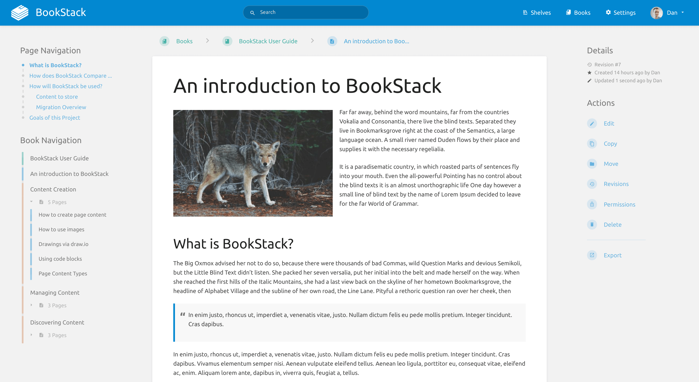

# Home Assistant Community Add-on: Bookstack

[![GitHub Release][releases-shield]][releases]
![Project Stage][project-stage-shield]
[![License][license-shield]](LICENSE.md)

![Supports aarch64 Architecture][aarch64-shield]
![Supports amd64 Architecture][amd64-shield]
![Supports armhf Architecture][armhf-shield]
![Supports armv7 Architecture][armv7-shield]
![Supports i386 Architecture][i386-shield]

[![GitLab CI][gitlabci-shield]][gitlabci]
![Project Maintenance][maintenance-shield]
[![GitHub Activity][commits-shield]][commits]

[![Discord][discord-shield]][discord]

[![Buy me a coffee][buymeacoffee-shield]][buymeacoffee]

Bookstack: Simple & Free Wiki Software.

## About

BookStack is a simple, self-hosted, easy-to-use platform for organising and
storing information. Please support the developers of this software at
[Bookstack].



## Installation

The installation of this add-on is pretty straightforward and not different in
comparison to installing any other Home Assistant add-on.

1. Search for the "bookstack" add-on in the add-on store and install it.
1. Start the "bookstack" add-on
1. Check the logs of the "bookstack" add-on to see if everything went well.
1. Default login information is admin@admin.com/password.

## Configuration

**Note**: _Remember to restart the add-on when the configuration is changed._

Example add-on configuration:

```yaml
log_level: info
ssl: false
certfile: fullchain.pem
keyfile: privkey.pem
```

**Note**: _This is just an example, don't copy and paste it! Create your own!_

### Option: `log_level`

The `log_level` option controls the level of log output by the addon and can
be changed to be more or less verbose, which might be useful when you are
dealing with an unknown issue. Possible values are:

- `trace`: Show every detail, like all called internal functions.
- `debug`: Shows detailed debug information.
- `info`: Normal (usually) interesting events.
- `warning`: Exceptional occurrences that are not errors.
- `error`:  Runtime errors that do not require immediate action.
- `fatal`: Something went terribly wrong. Add-on becomes unusable.

Please note that each level automatically includes log messages from a
more severe level, e.g., `debug` also shows `info` messages. By default,
the `log_level` is set to `info`, which is the recommended setting unless
you are troubleshooting.

### Option: `ssl`

Enables/Disables SSL (HTTPS) on the web interface of Bookstack
Panel. Set it `true` to enable it, `false` otherwise.

### Option: `certfile`

The certificate file to use for SSL.

**Note**: _The file MUST be stored in `/ssl/`, which is the default_

### Option: `keyfile`

The private key file to use for SSL.

**Note**: _The file MUST be stored in `/ssl/`, which is the default_

### Option: `proxy_host`

If using a reverse proxy, the domain configured for example
`https://www.example.com`.

### Option: `remote_mysql_host`

If using an external database, the hostname/address for the MYSQL/MariaDB
database.

### Option: `remote_mysql_database`

Only applies if a remote MYSQL database is used, the name of the database.

### Option: `remote_mysql_username`

Only applies if a remote MYSQL database is used, the username with permissions.

### Option: `remote_mysql_password`

Only applies if a remote MYSQL database is used, the password of the above user.

### Option: `remote_mysql_port`

Only applies if a remote MYSQL database is used, the port that the database
server is listening on.

## Database usage

By default, Bookstack will automatically use and configure the Home Assistant
MariaDB addon which should be installed prior to startup, this can be changed
within the configuration to use an external MySql/MariaDB Database. Please note
that there is no easy upgrade path between the two options.

## Known issues and limitations

- SMTP support is disabled.
- Ingress will not function due to the way the application stores image files.

## Changelog & Releases

This repository keeps a change log using [GitHub's releases][releases]
functionality. The format of the log is based on
[Keep a Changelog][keepchangelog].

Releases are based on [Semantic Versioning][semver], and use the format
of ``MAJOR.MINOR.PATCH``. In a nutshell, the version will be incremented
based on the following:

- ``MAJOR``: Incompatible or major changes.
- ``MINOR``: Backwards-compatible new features and enhancements.
- ``PATCH``: Backwards-compatible bugfixes and package updates.

## Support

Got questions?

You have several options to get them answered:

- The [Home Assistant Community Add-ons Discord chat server][discord] for add-on
  support and feature requests.
- The [Home Assistant Discord chat server][discord-ha] for general Home
  Assistant discussions and questions.
- The Home Assistant [Community Forum][forum].
- Join the [Reddit subreddit][reddit] in [/r/homeassistant][reddit]

You could also [open an issue here][issue] GitHub.

## Contributing

This is an active open-source project. We are always open to people who want to
use the code or contribute to it.

We have set up a separate document containing our
[contribution guidelines](CONTRIBUTING.md).

Thank you for being involved! :heart_eyes:

## Authors & contributors

The original setup of this repository is by [Paul Sinclair][sinclairpaul].

For a full list of all authors and contributors,
check [the contributor's page][contributors].

## We have got some Home Assistant add-ons for you

Want some more functionality to your Home Assistant instance?

We have created multiple add-ons for Home Assistant. For a full list, check out
our [GitHub Repository][repository].

## License

MIT License

Copyright (c) 2019-2020 Paul Sinclair

Permission is hereby granted, free of charge, to any person obtaining a copy
of this software and associated documentation files (the "Software"), to deal
in the Software without restriction, including without limitation the rights
to use, copy, modify, merge, publish, distribute, sublicense, and/or sell
copies of the Software, and to permit persons to whom the Software is
furnished to do so, subject to the following conditions:

The above copyright notice and this permission notice shall be included in all
copies or substantial portions of the Software.

THE SOFTWARE IS PROVIDED "AS IS", WITHOUT WARRANTY OF ANY KIND, EXPRESS OR
IMPLIED, INCLUDING BUT NOT LIMITED TO THE WARRANTIES OF MERCHANTABILITY,
FITNESS FOR A PARTICULAR PURPOSE AND NONINFRINGEMENT. IN NO EVENT SHALL THE
AUTHORS OR COPYRIGHT HOLDERS BE LIABLE FOR ANY CLAIM, DAMAGES OR OTHER
LIABILITY, WHETHER IN AN ACTION OF CONTRACT, TORT OR OTHERWISE, ARISING FROM,
OUT OF OR IN CONNECTION WITH THE SOFTWARE OR THE USE OR OTHER DEALINGS IN THE
SOFTWARE.

[aarch64-shield]: https://img.shields.io/badge/aarch64-yes-green.svg
[alpine-packages]: https://pkgs.alpinelinux.org/packages
[amd64-shield]: https://img.shields.io/badge/amd64-yes-green.svg
[armhf-shield]: https://img.shields.io/badge/armhf-yes-green.svg
[armv7-shield]: https://img.shields.io/badge/armv7-yes-green.svg
[bookstack]: https://www.bookstackapp.com/
[buymeacoffee-shield]: https://www.buymeacoffee.com/assets/img/guidelines/download-assets-sm-2.svg
[buymeacoffee]: https://www.buymeacoffee.com/sinclairpaul
[commits-shield]: https://img.shields.io/github/commit-activity/y/hassio-addons/addon-bookstack.svg
[commits]: https://github.com/hassio-addons/addon-bookstack/commits/master
[contributors]: https://github.com/hassio-addons/addon-bookstack/graphs/contributors
[discord-ha]: https://discord.gg/c5DvZ4e
[discord-shield]: https://img.shields.io/discord/478094546522079232.svg
[discord]: https://discord.me/hassioaddons
[forum-shield]: https://img.shields.io/badge/community-forum-brightgreen.svg
[forum]: https://community.home-assistant.io/t/community-hass-io-xxxxx/xxxxx
[sinclairpaul]: https://github.com/sinclairpaul
[gitlabci-shield]: https://gitlab.com/hassio-addons/addon-bookstack/badges/master/pipeline.svg
[gitlabci]: https://gitlab.com/hassio-addons/addon-bookstack/pipelines
[home-assistant]: https://home-assistant.io
[i386-shield]: https://img.shields.io/badge/i386-yes-green.svg
[issue]: https://github.com/hassio-addons/addon-bookstack/issues
[keepchangelog]: http://keepachangelog.com/en/1.0.0/
[license-shield]: https://img.shields.io/github/license/hassio-addons/addon-bookstack.svg
[maintenance-shield]: https://img.shields.io/maintenance/yes/2020.svg
[npm-packages]: https://www.npmjs.com
[project-stage-shield]: https://img.shields.io/badge/project%20stage-experimental-yellow.svg
[reddit]: https://reddit.com/r/homeassistant
[releases-shield]: https://img.shields.io/github/release/hassio-addons/addon-bookstack.svg
[releases]: https://github.com/hassio-addons/addon-bookstack/releases
[repository]: https://github.com/hassio-addons/repository
[semver]: http://semver.org/spec/v2.0.0
